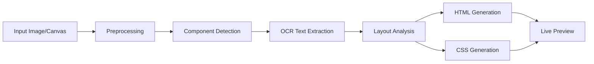

# CodeBuddy System Architecture

## Overview

CodeBuddy is a deterministic, rule-based web application that converts UI sketches (hand-drawn or digital) into semantic HTML and CSS code. The system prioritizes explainability, academic clarity, and reproducible results over black-box AI approaches.

## System Purpose

- **Input**: Canvas drawings or uploaded images of UI sketches
- **Output**: Clean semantic HTML + structured CSS
- **Approach**: Rule-based component detection + spatial layout analysis

## Technology Stack

### Frontend
- **HTML5** for structure
- **Vanilla CSS** for styling (dark mode, modern design)
- **Vanilla JavaScript** for interactivity
- **HTML5 Canvas API** for drawing interface

### Backend
- **Python 3.x** with FastAPI framework
- **OpenCV** for image preprocessing and contour detection
- **Tesseract OCR** for text extraction
- **NumPy** for image processing operations

## Processing Pipeline



## Detailed Pipeline Stages

### 1. Image Preprocessing (`preprocessor.py`)

**Purpose**: Prepare the image for component detection

**Steps**:
1. Decode image bytes to OpenCV format
2. Convert to grayscale
3. Apply Gaussian blur (5x5 kernel) to reduce noise
4. Canny edge detection (thresholds: 50, 150)
5. Morphological dilation to close gaps in edges

**Output**: Dictionary containing original, grayscale, edges, and dilated images

### 2. Component Detection (`detector.py`)

**Purpose**: Identify UI components using rule-based classification

**Algorithm**:
1. Find contours using `cv2.findContours` with `RETR_TREE` hierarchy
2. Filter noise (area < 500 pixels)
3. Approximate contours to reduce vertices
4. Focus on rectangular shapes (4 vertices)
5. Classify based on geometric properties:

| Component | Area | Aspect Ratio | Height | Notes |
|-----------|------|--------------|--------|-------|
| **Checkbox** | 200-2000 | 0.8-1.2 | - | Small, square |
| **Input Field** | - | > 2.5 | < 60px | Wide, short |
| **Button** | < 20000 | 1.5-4.0 | > 30px | Moderate size |
| **Container** | > 40000 | - | - | Large area |

**Duplicate Filtering**:
- Uses Intersection over Union (IoU > 0.75) to detect duplicates
- Removes inner contours of thick borders
- Keeps larger components when overlap detected

### 3. OCR Text Extraction (`text_extractor.py`)

**Purpose**: Extract text labels from detected components

**Preprocessing for OCR**:
1. Extract region of interest (ROI) with padding
2. Apply bilateral filter to reduce noise while preserving edges
3. Adaptive thresholding (better for varying lighting than Otsu's method)
4. Morphological closing to clean up text

**Tesseract Configuration**:
- PSM 7: Treat image as single text line
- Output normalization:
  - Trim whitespace
  - Collapse multiple spaces
  - Remove OCR artifacts
  - Capitalize first letter

**Fallback Text**:
- Button → "Button"
- Input → "Enter text"
- Label → "Label"
- Checkbox → "Option"

### 4. Layout Analysis (`layout_engine.py`)

**Purpose**: Group components into rows and columns based on spatial relationships

**Algorithm**:
1. Sort components by Y-coordinate (top to bottom), then X-coordinate (left to right)
2. Group into rows using vertical center distance:
   - Calculate center Y positions
   - If vertical distance < 60% of average height → same row
   - Otherwise → new row
3. Sort components within each row by X-coordinate
4. **Critical**: Track used component IDs to prevent duplicates
5. Build layout tree:
   - Root node (column direction)
   - Row nodes (row direction with Flexbox)
   - Leaf nodes (individual components)

**Validation**:
- Ensures each component used exactly once
- Logs warnings if duplicates detected
- Verifies component count matches input

### 5. HTML Generation (`html_gen.py`)

**Purpose**: Generate semantic HTML from layout tree

**Features**:
- Recursive tree traversal
- Component ID comments for debugging
- HTML escaping to prevent malformed output
- Proper indentation for readability
- Semantic tags:
  - `<button>` for buttons
  - `<input type="text">` for input fields
  - `<label>` for labels
  - `<input type="checkbox">` + `<label>` for checkboxes
  - `<div class="card">` for containers

### 6. CSS Generation (`css_gen.py`)

**Purpose**: Provide clean, modern styling for generated components

**Features**:
- Flexbox-based layout system
- Comprehensive class documentation
- Hover and focus states
- Consistent spacing and alignment
- Fallback styles for unknown components

## Component Flow Example

**Input**: User draws 2 buttons and 1 input field

```
Detection:
  comp_000: button (x:50, y:100, w:120, h:40)
  comp_001: button (x:200, y:100, w:120, h:40)
  comp_002: input (x:50, y:160, w:300, h:35)

Layout Analysis:
  Row 1: [comp_000, comp_001]  (vertical distance: 0)
  Row 2: [comp_002]            (vertical distance: 60)

Generated HTML:
  <div class="row-container">
    <!-- comp_000: button -->
    <button class="btn">Submit</button>
    <!-- comp_001: button -->
    <button class="btn">Cancel</button>
  </div>
  <div class="row-container">
    <!-- comp_002: input -->
    <input type="text" class="input-field" placeholder="Enter name" />
  </div>
```

## Known Limitations

### Accepted Constraints
1. **OCR Accuracy**: Depends on handwriting clarity and sketch quality
2. **Component Types**: Limited to buttons, inputs, checkboxes, labels, containers
3. **Layout Complexity**: Simple row/column layouts only (no grid, no nested containers)
4. **Responsive Design**: Not supported (fixed desktop layout)
5. **Styling**: Generic CSS, no color/font detection from sketch

### Design Decisions
- **Rule-based over ML**: Ensures deterministic, explainable results
- **No frameworks**: Academic clarity and simplicity
- **No cloud APIs**: Fully local processing
- **Geometric classification**: Simple, fast, and transparent

## API Endpoints

### `POST /api/upload`

**Request**:
- Content-Type: `multipart/form-data`
- Body: `file` (image/png, image/jpeg)

**Response**:
```json
{
  "html": "<div id=\"generated-content\">...</div>",
  "css": "/* Generated CSS */...",
  "components": [
    {
      "id": "comp_000",
      "type": "button",
      "bbox": [50, 100, 120, 40],
      "text": "Submit"
    }
  ]
}
```

## Frontend Architecture

### Components
- **CanvasEditor** (`canvas.js`): Drawing interface with rectangle and text tools
- **ApiService** (`api.js`): HTTP client for backend communication
- **App** (`app.js`): Main application logic, tab switching, conversion flow

### User Flow
1. User selects "Draw" or "Upload" tab
2. Creates UI sketch (canvas drawing or image upload)
3. Clicks "Convert to Code"
4. Frontend validates input (canvas not empty / file selected)
5. Shows loading overlay
6. Calls backend API
7. Displays result in "Preview" or "Code" view
8. Shows success/error notification

## Error Handling

### Backend
- Image decoding failures → 500 error with detail
- OCR failures → Warning logged, fallback text used
- Component detection failures → Empty components list

### Frontend
- Empty canvas → Error notification
- No file selected → Error notification
- API timeout → Error notification with retry suggestion
- Network errors → User-friendly error message

## Academic Quality Features

1. **Comprehensive Logging**: Every pipeline stage logs metrics
2. **Inline Comments**: All functions documented with purpose and algorithm
3. **Validation**: Component count verification, duplicate detection
4. **Debugging Aids**: Component ID comments in generated HTML
5. **Clear Naming**: Descriptive variable and function names
6. **Modular Design**: Separation of concerns across files

## Future Enhancements (Out of Scope)

- Deep learning-based component detection
- Color and font extraction from sketches
- Nested container support
- Responsive layout generation
- Export to React/Vue components
- Real-time collaborative sketching
